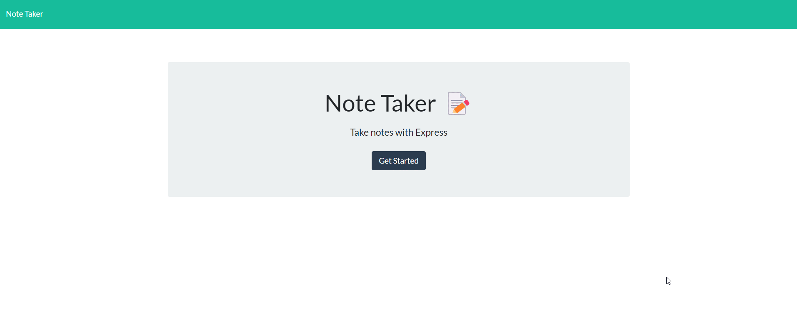
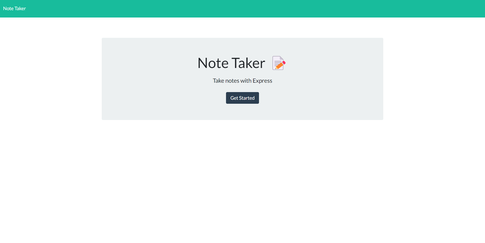
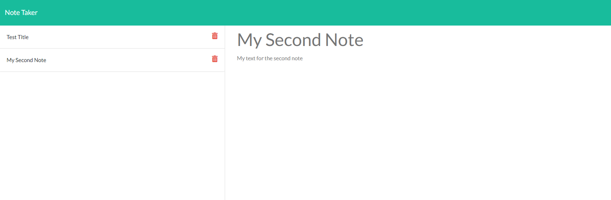
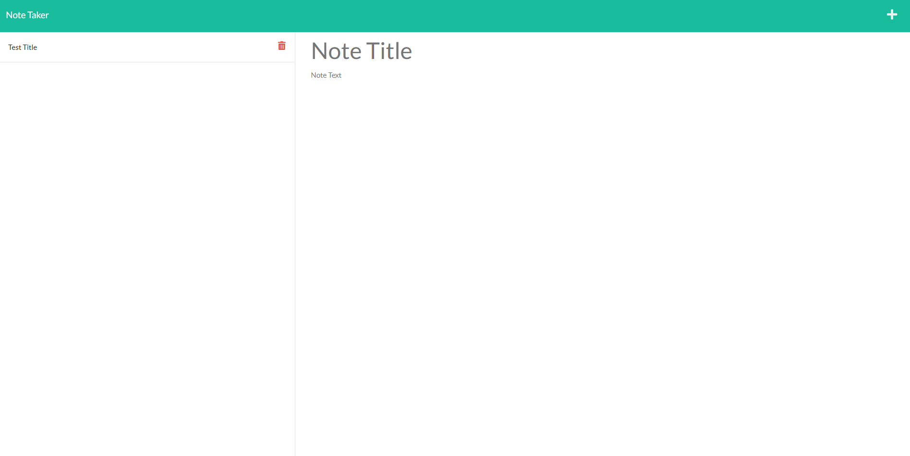
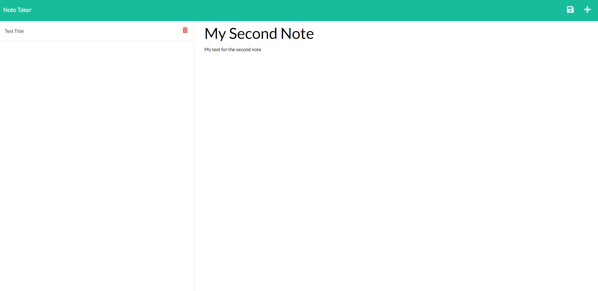
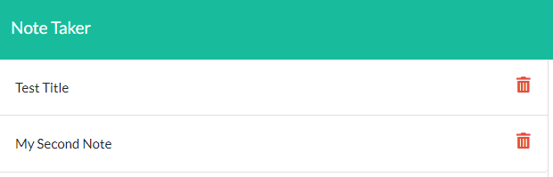
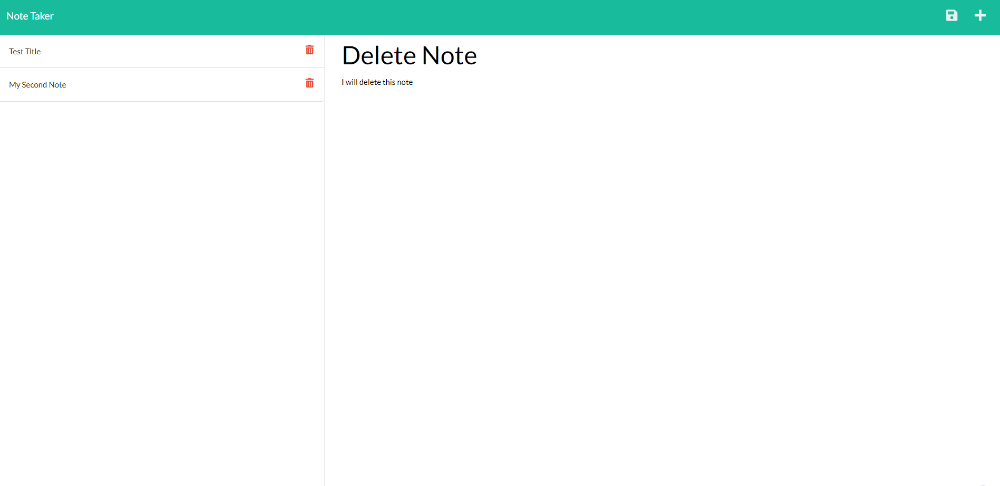
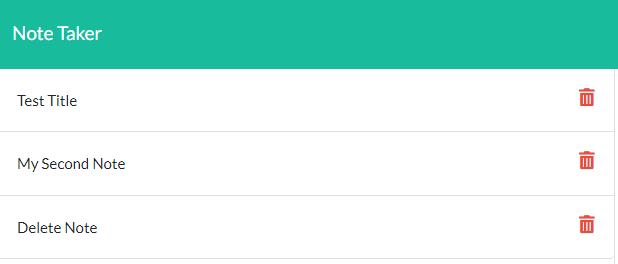
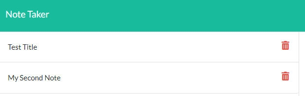

# NoteBook

## Description 

This is the Notebook Buddy. An application for logging all of your notes. Keeping them clean, organized, and minimal for daily tasks or overall thoughts!
This application uses express.js and node.js to enable api get and post methodologies as well as allows for port usage on a local computer.

[Visit my deployed app on heroku](https://note-book-buddy-taker-app.herokuapp.com/)

## Mock-Up
### Here is a GIF to demo the Notebook Buddy:


The following image shows the homepage of the Notebook Buddy.



The following image shows the notes page of the Notebook Buddy.



## Table of Contents

* [Installation](#installation)
* [Code Example](#code-example)
* [Usage](#usage)
* [Learning Points](#learning-points)
* [Author Info](#author-info)
* [Credits](#credits)
* [License](#license)

## Installation

If you would like to visit my live site:
https://note-book-buddy-taker-app.herokuapp.com/

If you would like to get your own copy of Notebook Buddy on your computer:
1. Clone down the repository or download all files within repository
2. You will need node.js and express.js, as well as path packages ("npm i _put-package-here_")
3. Open terminal within VS Code and type 'node server.js'
4. Click the "Get Started" button and enjoy the app!


## Code Example

Here is an example of one of my post api methods that code creates a route that accepts new notes, adds them to a JSON file, and responds with a success or error message depending on the outcome of the file operations.

server.js:
```javascript
app.post('/api/notes', (req, res) => {
  const { title, text } = req.body;

  if (title && text) {
    const newNote = {
      title,
      text,
      id: uniqid('note-'),
    };

    fs.promises
      .readFile('./db/db.json', 'utf-8')
      .then((data) => {
        let parsedNotesData = JSON.parse(data);
        parsedNotesData.push(newNote);
        return fs.promises.writeFile(
          './db/db.json',
          JSON.stringify(parsedNotesData, null, 2)
        );
      })
      .then(() => {
        res.send('new note creation successful');
      })
      .catch((err) => {
        console.log(err);
        res.status(500).json('An error has occurred');
      });
  } else {
    // Use res.status().send() instead of req.status().json()
    res.status(500).send('An error has occurred');
  }
});
```

## Usage

## Here is a GIF to show the NoteBook Buddy in action:
[Example Application Usage](https://watch.screencastify.com/v/Cm0qja6cWXNEyOkbHjFJ)

Here you can see the home page of Notebook Buddy:


Here you can see after clicking "Get Started" the notes page:



Here you can see how you are able to type a title and text for notes:



Here you can see you can save notes using the save icon on the right hand side and it saves to the left hand side for future reference:



Here you can see you are able to click on past notes for reference in the future:


Here you can see that you are able to delete notes by click the red trash icon beside each note:






## Learning Points 

This was a was a great introduction into the use cases and ability of express.js. I think that going forward I am comfortable knowing that express.js will always be a useful tool in my back pocket. From pushing data into different .json files, to being able to host on local host with port usages I think that I will definitely be able to use express to the best of my ability in the future. All in all there were a few mishaps with paths and making sure I had the right paths going, however once I figured out how to organize and keep track of my file and paths express truly made this application stand out.

## About Me

Hi, my name is Bryan Nguyen I am an up and coming full-stack web developer working
on getting into the space with projects that support both my growth, belief, and imagination. I hope to one day work within the realm of AI, web-development, and even site-reliability/cyber-security.

## My links

* [Portfolio](https://bryannguyen9.github.io/Bryan-Nguyen-Portfolio/)
* [LinkedIn](https://linkedin.com/in/bryannguyen9)
* [Github](https://github.com/bryannguyen9)


## Credits

### Special thanks to David Chung: 
 
 * His Github Portfolio: [David-Chung-Github](https://github.com/dchung13/)
 * His Linked-In: [David-Chung-LinkedIn](https://www.linkedin.com/in/david-chung-77141526b/)
 * His Portfolio Site: [David-Chung-Portfolio](https://dchung13.github.io/David-Chung-Portfolio/) 

### Special thanks to these reference websites that taught me different functionalities that enabled a seamless experience for users.

1. [Express.js](https://expressjs.com/en/guide/routing.html)
2. [Geeksforgeeks](https://www.geeksforgeeks.org/express-js/)
3. [Tutorialspoint](https://www.tutorialspoint.com/expressjs/index.htm)

## License

MIT License

Copyright (c) [2023] [Bryan-Nguyen]

Permission is hereby granted, free of charge, to any person obtaining a copy
of this software and associated documentation files (the "Software"), to deal
in the Software without restriction, including without limitation the rights
to use, copy, modify, merge, publish, distribute, sublicense, and/or sell
copies of the Software, and to permit persons to whom the Software is
furnished to do so, subject to the following conditions:

The above copyright notice and this permission notice shall be included in all
copies or substantial portions of the Software.

THE SOFTWARE IS PROVIDED "AS IS", WITHOUT WARRANTY OF ANY KIND, EXPRESS OR
IMPLIED, INCLUDING BUT NOT LIMITED TO THE WARRANTIES OF MERCHANTABILITY,
FITNESS FOR A PARTICULAR PURPOSE AND NONINFRINGEMENT. IN NO EVENT SHALL THE
AUTHORS OR COPYRIGHT HOLDERS BE LIABLE FOR ANY CLAIM, DAMAGES OR OTHER
LIABILITY, WHETHER IN AN ACTION OF CONTRACT, TORT OR OTHERWISE, ARISING FROM,
OUT OF OR IN CONNECTION WITH THE SOFTWARE OR THE USE OR OTHER DEALINGS IN THE
SOFTWARE.


